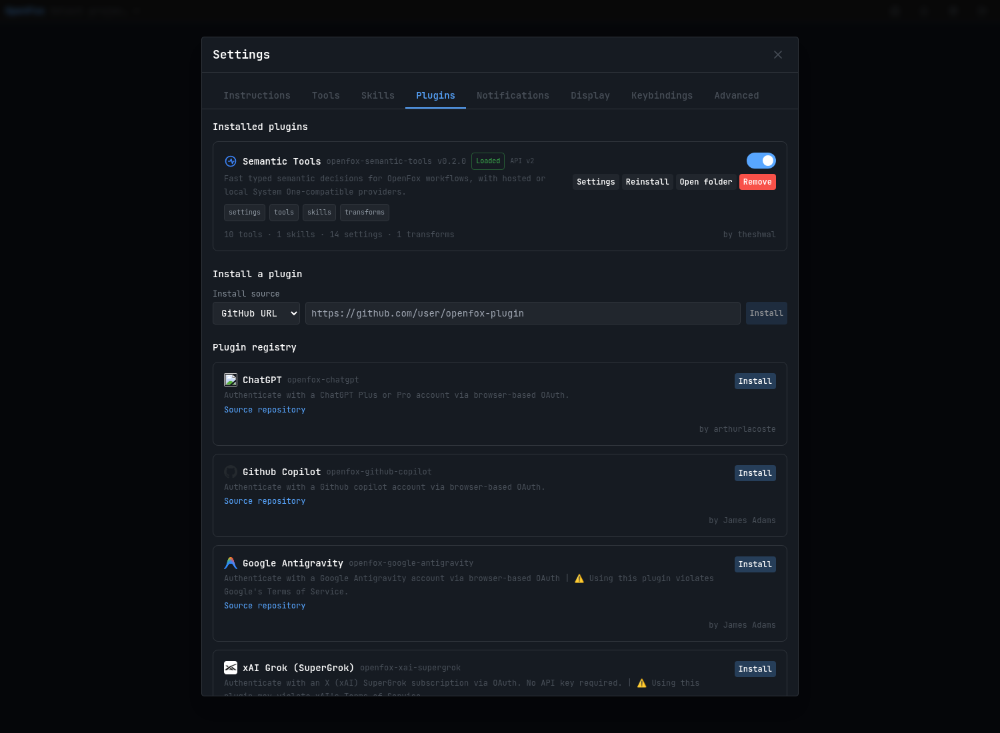
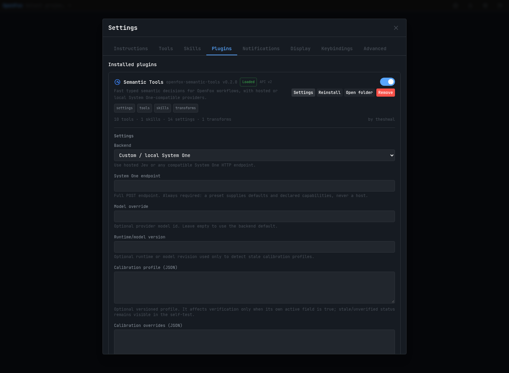

# User guide

Task-oriented documentation for people **using** this plugin. For the protocol,
the provider contract and the evaluation rules, see
[PROVIDERS.md](./PROVIDERS.md) and [EVALUATION.md](./EVALUATION.md).

Two documents, two audiences:

| You want to | Read |
| --- | --- |
| Install it, configure it, call a tool, know what it will NOT do | **this file** |
| Understand the wire protocol, the calibration maths, the evidence | [PROVIDERS.md](./PROVIDERS.md), [EVALUATION.md](./EVALUATION.md), [ARCHITECTURE.md](./ARCHITECTURE.md) |

---

## 1. Install

**Recommended: from a source checkout, by absolute local path.** This is the
only recipe the project verifies end to end.

```bash
git clone --depth 1 --branch <tag-or-branch> \
  https://github.com/theshwal/openfox-semantic-tools.git \
  "$HOME/src/semantic-tools"
cd "$HOME/src/semantic-tools"
npm ci --ignore-scripts
npm run build
```

Then in OpenFox: **Settings → Plugins → install from local path**, and give the
absolute path (it must start with `/`). Enable it.



<sub>The card shows the declared capabilities, the contribution counts the host
itself computed (`10 tools · 1 skills · 14 settings · 1 transforms`), and the
author. Captured on OpenFox 2.0.161 against a throwaway instance.</sub>

Why not the packed `.tgz`? `npm pack` ships only `dist/`, `README.md` and
`docs/`, so the installer finds a `build` script with no `tsconfig.json` beside
it and the install fails. Full explanation, and the GitHub-URL caveat, in
[INSTALLATION.md](./INSTALLATION.md).

Verify your install without spending anything:

```bash
npm run verify:local
```

That runs every offline check and then prints exactly which steps remain manual.

## 2. Configure

All settings live in the plugin's own panel. Two rows matter first.



<sub>Rendered by the host from this plugin's schema. Every field carries its own
explanation, so nothing here has to be looked up elsewhere.</sub>

### `endpoint` — required

The **full POST URL** of a System One-compatible runtime, e.g.
`https://example.com/v1/systemone`. A preset never supplies a host: it gives
you defaults and declared capabilities, never an endpoint. Until this is set,
every tool fails with `Configure a full System One endpoint…` — that is by
design, not a bug.

### `apiKey` — only if your endpoint needs one

Stored as a secret and never returned in clear text or logged. Local runtimes
usually need none.

### `endpointClass` and `egressPolicy` — read this before pointing it at a remote host

`endpointClass` auto-detects local / private / remote. `egressPolicy` then
decides what may be sent where:

| Policy | Effect |
| --- | --- |
| `allow` (default) | Anything may be sent. |
| `block-remote-automatic` | **Explicit** tool calls allowed; automatic calls (code discovery, context reduction) blocked for remote hosts. **Recommended.** |
| `block-remote-all` | Nothing is ever sent to a remote host, even when you ask. |

The default is `allow` because that is what "I installed this plugin" implies.
If you would rather opt in, switch it now — the setting only ever *blocks*.

### `contextReduce` — off, and here is why

Off by default. It asks the provider which earlier conversation messages are no
longer needed, before each LLM call. Its recorded verdict is **DEFER**: no token,
cost, latency or task-quality benefit has been measured. Leave it off unless
you have read [EVALUATION.md](./EVALUATION.md) and accept the risk.

### `cacheEnabled` — off by default

Reuses an identical previous answer instead of asking again. Only successful
answers are ever reused, never an error. Leave it off unless you have measured
a benefit.

## 3. Allow the tools you want

Registering a tool does **not** grant access. Add the tools to the agent's
`allowedTools` in Settings → Agents. Without that, the agent cannot call them
and you will see a refusal, not a silent failure.

## 4. Use the tools

### `semantic_decide` — the primitive

One state, several batched questions. Returns typed probabilities.

```json
{
  "state": {"evidence": "public synthetic excerpt"},
  "questions": {
    "satisfied": {"type": "noul", "instructions": "Does the evidence satisfy the criterion?"},
    "region": {"type": "choice", "instructions": "Choose the relevant region", "criteria": ["handler", "database"]},
    "coverage": {"type": "score", "instructions": "Rate evidence completeness", "criteria": ["absent", "complete"]}
  }
}
```

- `noul` → yes/no with a probability.
- `choice` → pick one of your labels.
- `score` → place the state on your ordered rubric. **Criteria must be an
  ordered array**; object maps are rejected for `score`.

Batch every question about the same state into one call: it is a single
round-trip.

### `semantic_verify_task` — one acceptance criterion

Advisory. It returns `unknown` or a follow-up status until a calibration
profile is measured and installed, so **it cannot currently mark anything
satisfied**. That is intentional: an uncalibrated checker must never produce a
positive verdict.

### `semantic_issue_coverage` — several criteria at once

Same contract, wider scope. Reports coverage and follow-ups; never merge-safe.

### `semantic_search` / `semantic_scan` — find candidates

- `semantic_search`: from a natural-language query. With no `candidates`, it
  does a bounded local recall first and then reranks; with explicit
  `candidates`, it skips recall.
- `semantic_scan`: scores an explicit file list you supply. It never guesses
  which files to read.

Both return **ranked candidates**, never verdicts. Confirm them with `read_file`
/ `semantic_search` as you normally would.

### `semantic_provider_self_test` — check the wiring

Synthetic, embedded, free. Run it after configuring an endpoint: `reachable:
true` and `deviations: []` means the transport is fine. It says nothing about
decision quality.

A `smoke_mismatch` on `insufficient-evidence` is a known and documented
behaviour on some runtimes: the plugin rejects an internally inconsistent answer
rather than trusting it. That is the safe outcome, not a defect.

### `semantic_transform_status` — see what the transform did

Pure reader. Reports applied turns, segments dropped and, when a turn was left
alone, **why** (`no_candidates`, `low_confidence`, `egress_blocked`,
`provider_unavailable`, `invalid_response`, `total_wipe_refused`, …). Counts and
reasons only: no message content is retained.

If you enable `contextReduce` and nothing seems to happen, this is where you
look. A no-op is always explained.

### Calibration tools — for operators, not for everyday use

You do not need these to use the plugin. They exist so the *evidence* behind a
threshold can be produced by hand, and every one of them is inactive by
construction.

| Tool | What it does | What it will never do |
| --- | --- | --- |
| `semantic_calibration_candidate` | Turns a case set you labelled by hand into an **inactive** candidate profile. | Never activates anything, never loosens a policy. |
| `semantic_question_calibration` | Scores one question of your choice against your labelled cases and reports agreement and error. | Never sets a threshold. |
| `semantic_reference_agreement` | Compares the provider against your reference judgments on a frozen case set. | Never ranks providers, never activates anything. |

The shipped policy is `calibrated: false`, so `semantic_verify_task` cannot emit
a positive verdict until you deliberately install a measured profile. See
[CALIBRATION.md](./CALIBRATION.md).

## 5. What this plugin will never do

These are guarantees, not limitations:

- It never replaces tests, typechecks or linters.
- It never marks a task complete or merge-safe.
- It never branches a workflow on a semantic result: no transition handler and
  no hook are registered.
- It never blocks a turn — a transform cannot veto one.
- It never deletes the current request or anything after the last tool result.
- A provider error, timeout or malformed answer never becomes a positive
  result. It becomes a structured failure.
- API keys are never logged or echoed in errors.
- Redirects are refused; error bodies are never reflected back.

## 6. Troubleshooting

| Symptom | Meaning |
| --- | --- |
| `Configure a full System One endpoint…` | `endpoint` is empty. Nothing else is wrong. |
| `Unsupported backend "…"` | The saved preset id is unknown. Pick one from the selector. |
| The agent refuses to call a tool | It is not in that agent's `allowedTools`. |
| `no provider call was made` (harness) | Correct: the harness never contacts a provider. |
| A `score` question is rejected | `score` criteria must be an ordered **array**; object maps are only valid for `choice`. The message says so. |
| Enabling `contextReduce` changes nothing | Expected. Check `semantic_transform_status` for the reason; `no_candidates` and `low_confidence` are normal. |
| `egress_blocked` | `egressPolicy` forbids sending that content. Your policy, not a failure. |
| A remote endpoint rejects array `choice` criteria | The selected preset declares that deviation; the request is rewritten to the object form automatically. |

## 7. Honest limits

- No provider is endorsed, and no runtime is claimed compatible. `custom` is
  the default preset and stays that way.
- No decision-quality certification exists. Dated observations live in
  [#9](https://github.com/theshwal/openfox-semantic-tools/issues/9).
- No token, cost or latency saving is claimed for any feature here, because none
  has been measured. The context-reduction transform is **DEFER**.
- Provider presets record *declared* capabilities from real conformance runs.
  `unverified` means nobody asked — never "works".

## 8. Keeping this file useful

This guide is about tasks, not architecture. When you add a tool, add a row to
§4 and, if it can fail in a confusing way, a row to §6. When you change what
the plugin refuses to do, update §5 — those are promises, and the tests assert
them.